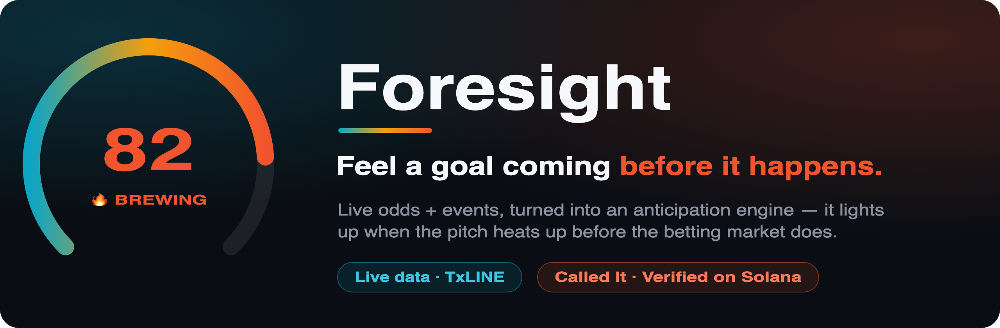
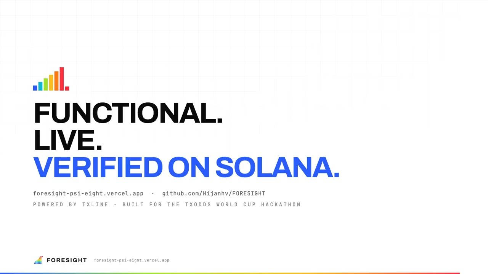
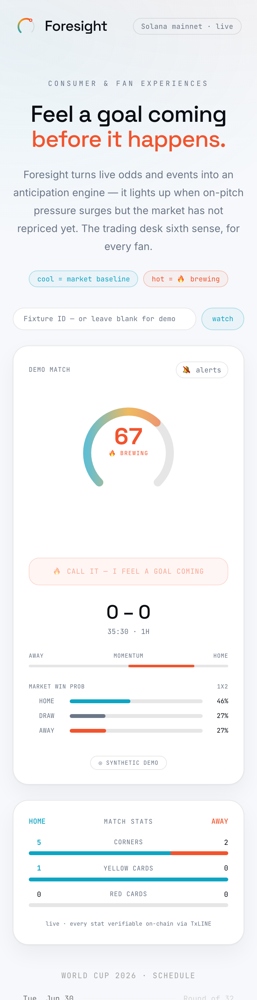
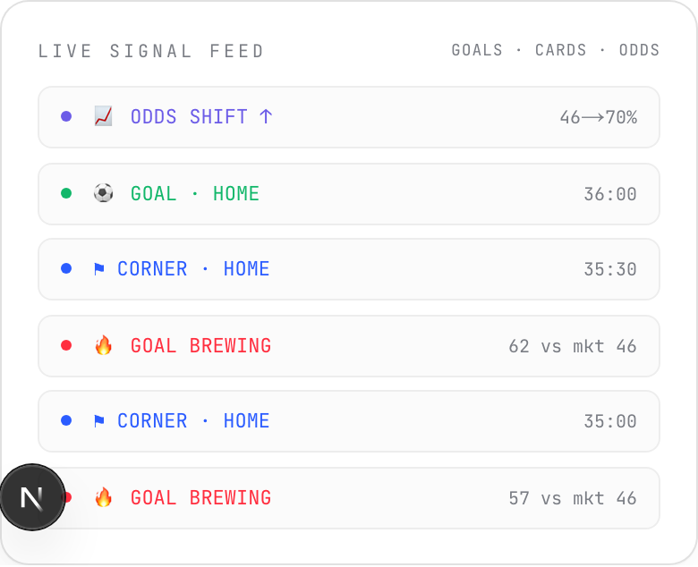
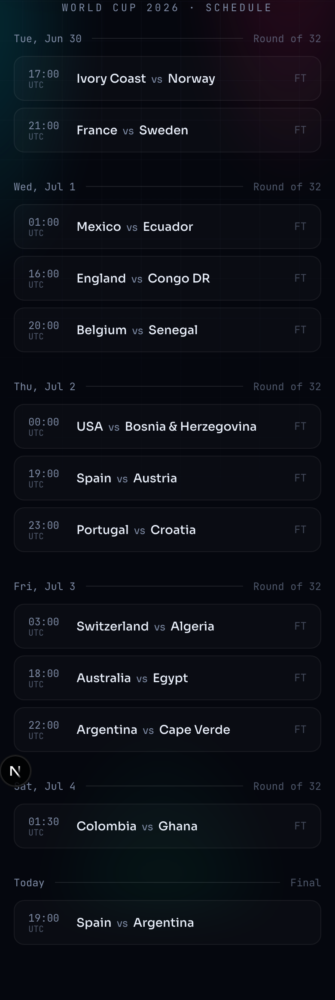

# Foresight

> **Feel the goal coming before the market does.**

Foresight turns live World Cup odds and pitch events into an **anticipation engine**. It lights up the moment on-pitch pressure surges but the betting market *hasn't repriced yet*: the trading-desk sixth sense, packaged for every fan. Then it lets fans **prove they called it, on-chain**.

Built for the **TxODDS World Cup Hackathon** (Consumer & Fan Experiences track) on Superteam Earn. Powered by **TxLINE** live data, verified on **Solana mainnet**.

**▶ Live app: https://foresight-psi-eight.vercel.app**  ·  **🎥 Demo: https://youtu.be/ft3stLQtXUs**  ·  **🐦 Thread: https://x.com/JanhaviChavada/status/2078805229458624926**  ·  **Repo: https://github.com/Hijanhv/FORESIGHT**

<p align="center">
  <a href="https://youtu.be/ft3stLQtXUs">
    
  </a>
  <br />
  <sub><b>🎥 Watch the demo</b> · the live app, the on-chain Solana sign-up, and a real mainnet &ldquo;Called It&rdquo; transaction · <a href="https://youtu.be/ft3stLQtXUs">youtu.be/ft3stLQtXUs</a></sub>
</p>

> Try it in ten seconds: open the link on your phone and add `?demo=1` for a guided, scripted match that plays the "goal brewing" moment on a loop.

---

## See it in action

<table>
<tr>
<td width="33%" valign="top">

<br /><sub><b>🔥 Brewing.</b> Anticipation high, score still 0-0, market asleep at 46%. The gauge fires red <em>before</em> the goal, and one tap records your read on-chain.</sub>
</td>
<td width="33%" valign="top">

<br /><sub><b>Live signal feed.</b> Every goal, card and odds shift the instant it happens. Colour-coded, in-app, no bot to install.</sub>
</td>
<td width="33%" valign="top">

<br /><sub><b>Every game.</b> The whole World Cup. Tap any fixture to watch its gauge.</sub>
</td>
</tr>
</table>

<sub>Screenshots are the live production app (phone viewport). The gauge, scoreline, stats and feed are all real.</sub>

---

## Table of contents

- [The insight](#the-insight)
- [What a fan sees](#what-a-fan-sees)
- [How it works](#how-it-works)
  - [The anticipation engine](#the-anticipation-engine)
  - [The data pipeline](#the-data-pipeline)
- [The on-chain fan loop](#the-on-chain-fan-loop)
- [TxLINE endpoints used](#txline-endpoints-used)
- [Testing & validation](#testing--validation)
- [Impact & commercial path](#impact--commercial-path)
- [Tech stack](#tech-stack)
- [Run it locally](#run-it-locally)
- [Deployment](#deployment)
- [Project structure](#project-structure)
- [TxLINE API feedback](#txline-api-feedback)

---

## The insight

Professional traders know a secret casual fans don't: **on-pitch pressure surges *before* the market reprices.** When a side wins three corners in ninety seconds and starts hammering the box, the goal often hasn't happened yet, but the edge is already there. The instant the market moves, the edge is gone.

Foresight encodes exactly that gap into a single number:

```
anticipation = on-pitch pressure  ×  (1 − how much the market has already repriced)
```

High pressure **and** a flat market → `anticipation` climbs → **🔥 a goal is brewing.** The moment the market catches up, anticipation fades. It's a feeling every fan has ("something's coming here…"), turned into a live, quantified, shareable signal.

---

## What a fan sees

A single, phone-first screen:

- **The anticipation gauge.** A 0-100 thermal arc that sweeps cool (blue) to hot (red) and fires when a goal is brewing, over a live pitch-pressure heatmap, with an opt-in sound + haptic alert.
- **Live score, clock & phase**, including extra time and penalties.
- **Momentum bar:** which side is pressing, right now.
- **Market win-probability bars:** the sharp money's read, straight from TxLINE.
- **Live Signal Feed:** every goal, card and **odds shift** the instant it happens, colour-coded. The whole "alert me to everything" experience, in-app, with no bot to install.
- **Match Stats:** real per-side corners and cards from the feed, each one **verifiable on Solana**.
- **"Called It":** when it's brewing, connect your Solana wallet (one free signature, no transaction) and tap *I feel it* to mint a tamper-evident receipt **stamped with your wallet**. If the goal then lands, the app calls it: **✓ You called it, before the market moved.**

No signup, no friction: it opens straight to a live gauge (a scripted demo match plays whenever nothing is live, so the screen is never blank). Watching is walletless; **proving** a call takes one free wallet signature, no SOL and no transaction.

---

## How it works

```
TxLINE odds SSE   ─┐
                   ├─►  normalize  ─►  anticipation engine  ─►  ForesightFrame  ─►  gauge UI
TxLINE scores SSE ─┘   (raw → unified)   (deterministic          (clean stream)     (SSE → React)
                                          reducer over events)
```

### The anticipation engine

`lib/engine/anticipation.ts` is a **deterministic reducer**: the same ordered events always produce the same frames. That property is the backbone of the whole project. It makes a recorded match and a live feed completely interchangeable, and it's what lets us unit-test against real history.

- **On-pitch pressure** accumulates per side from corners (and, lightly, cards drawn), then **decays exponentially**, so a burst of pressure fades over ~90s if nothing comes of it.
- **Market response** is measured against a slow EMA baseline of the leading side's win probability. If the market has already moved toward the pressuring team, anticipation is discounted.
- `anticipation = normalizedPressure × (1 − marketResponse)`, clamped 0-1.
- **`brewing`** trips when pressure is high *and* the market is still asleep, but only while the ball is in play (including extra time).

Every knob lives in `DEFAULT_PARAMS`, tunable against replays.

### The data pipeline

- **Ingestion** (`lib/txline/`) authenticates with TxLINE, opens the odds + scores SSE streams, and normalizes each raw payload into one ordered `UnifiedEvent` stream. Vendor quirks (PascalCase odds, Asian-Handicap markets, per-participant stats) are isolated here.
- **Merge & run** (`app/api/live/route.ts`) interleaves both streams by timestamp, feeds them through the engine, and re-emits clean `ForesightFrame`s to the browser over its own SSE, with automatic reconnect/back-off so a dropped upstream connection self-heals.
- **The UI** (`components/gauge/`) is a thin `EventSource` subscriber. It prefers live data and transparently falls back to the scripted demo when no match is in play.

---

## The on-chain fan loop

Two features make the data *provably real* and give fans skin in the game. Both are pure `@solana/web3.js`, no custom program to audit, and **both are verified working on mainnet**:

### 1. "Called It": a receipt for your read, signed in with your wallet

First-time callers **sign in with Solana**: connect a wallet (Phantom / Solflare / Backpack) and sign a free ownership message, Ed25519, **no transaction and no SOL**, verified server-side. It's a plain [Sign-In-With-Solana](#sign-in-with-solana) handshake, no wallet-adapter stack. From then on, when the gauge is brewing and a fan taps **I feel it**, the server writes a Solana **memo** encoding the exact claim, now **stamped with the fan's wallet**:

```
Foresight · Called It 🔥 | Spain v Argentina | 85:00 | anticipation 88% vs market 44% | 1-1 | by 9ExbZjAa…cKaA | 2026-07-16T20:06:00Z
```

That's a timestamped, tamper-evident, shareable proof *they* saw it coming *before the market moved*, with a Solscan link. Real mainnet example: [`3drsCh2M…NWkqi`](https://solscan.io/tx/3drsCh2MjLUo16mmKGec9zCVUaqZZreBWTwMuuP2dpUdmr5y69nqVYEARcCHUKrATUV6un8u8LHQrAw5tM2NWkqi).

#### Sign-In-With-Solana

The fan proves wallet ownership without a password, an email, or a transaction:

```
GET  /api/auth/nonce   → server issues a stateless, HMAC-signed nonce
     wallet.signMessage → the fan signs "…sign in with your Solana account…"
POST /api/auth/verify  → server rebuilds the exact message, verifies the
                         Ed25519 signature, sets an httpOnly session cookie
```

No new dependency: the signature is verified with Node's built-in `crypto` (wrapping the public key in an SPKI envelope, the mirror of how `lib/solana.ts` signs). Nonces and sessions are stateless HMACs, so nothing has to be stored between requests, it survives serverless cold starts. The server still pays gas for the memo, so the fan needs **zero SOL** to get an attributed, on-chain receipt.

### 2. "Verified on Solana": every stat, provably anchored

TxLINE anchors every match stat into an on-chain Merkle root. Foresight surfaces that: tap **Verify latest stat on Solana** and the app fetches the live Merkle proof (event-stat root, proof depth, anchored-update count) and links to the on-chain daily-scores root program. This *is* the hackathon thesis: surfacing verifiable data, not re-inventing it.

Unlocking the TxLINE feed itself also runs on Solana: the app performs the on-chain **`subscribe`** instruction (Token-2022, free real-time World Cup tier) and activates its API token with a wallet signature.

---

## TxLINE endpoints used

| Endpoint | Purpose in Foresight |
| --- | --- |
| `POST /auth/guest/start` | Guest session JWT |
| `POST /api/token/activate` | Activate the long-lived API token with the Solana wallet signature |
| `GET /api/fixtures/snapshot` | Discover current fixtures + `Participant1IsHome` for correct home/away labelling |
| `GET /api/odds/stream` | Live de-margined odds (SSE), the "market brain" |
| `GET /api/scores/stream` | Live score events + cumulative stat map (SSE) |
| `GET /api/scores/stat-validation` | The Merkle proof behind the "Verified on Solana" badge |
| `GET /api/scores/historical/{id}` | Pull a finished match as a real replay + test fixture |

---

## Testing & validation

We didn't test against mocks. We tested against **the real World Cup feed**, and it changed the product. Running the live mainnet pipeline and replaying a **captured 1,243-event knockout stream** (Argentina 3-2 Cape Verde, R32, which went to extra time + penalties) surfaced five bugs that would each have broken the live demo. All are fixed and pinned by regression tests.

| # | What the real data exposed | Fix |
| --- | --- | --- |
| 1 | The feed carries **no 1X2 market**, only de-margined Asian Handicap (`part1/part2`). The old normalizer returned `null` for every tick → 0% probabilities, dead market signal. | Read the level (line=0) Asian Handicap as draw-no-bet win probability; keep a 1X2 path as fallback. |
| 2 | Many non-stat events carry an **empty `Stats {}`** map. Treating `{}` as a snapshot zeroed the score every few seconds. | Ignore empty snapshots entirely. |
| 3 | Goals/corners in **extra time** (status 7/9) fell outside the "in-play" set, so `brewing` silently died in ET, common in knockouts. | Extra-time halves are in-play; plus a clock-running fallback. |
| 4 | Live stats arrive as **duplicate "confirmed" + interleaved "possible"** events; naive counting double-counted or flickered. | Drive pressure/flashes from **Stats-snapshot deltas**, immune to feed noise. |
| 5 | Malformed SSE frame, or `setState`-in-effect lint error. | Skip bad frames without killing the stream; effect cleanup. |

**The suite (29 tests, all passing):**

- **Engine unit tests:** the synthetic "corner barrage → goal" arc trips `brewing` *before* the goal.
- **Real-data regression:** replays all 1,243 captured events and asserts the true final state (**3-2, corners 8-8, a yellow each**), that the **score never goes backwards** (the empty-`Stats` regression), monotonic corner accumulation, non-zero peak anticipation, and that real goals/corners flash to the UI.
- **Odds normalization:** pins the real Asian-Handicap shape (level line → win prob, non-level lines & `NA` ignored, `Participant1IsHome` respected).
- **Sign-In-With-Solana:** a generated keypair signs the exact sign-in message and the server accepts it, then rejects a wrong signer, a wrong domain, a tampered nonce, and a forged/expired session, proving the auth fails closed.

```bash
npm test      # 29 passed
npm run build # clean production build, TypeScript strict
npm run lint  # clean
```

**End-to-end, verified on mainnet:** guest auth → on-chain `subscribe` → token activation → live SSE → engine → UI, plus wallet sign-in, a real "Called It" memo tx and a real stat-validation proof. All confirmed against `https://txline.txodds.com` and Solana mainnet-beta, both locally and **on the live Vercel deployment**. The **Sign-In-With-Solana handshake** (nonce → wallet signature → httpOnly session cookie) is smoke-tested against the live production URL on every change, with no SOL spent.

---

## Impact & commercial path

**Why a fan opens it:** it makes watching *more exciting*. A shared "something's coming!" meter that turns every passage of play into a mini-event, and a way to prove your read and flex it to the group chat. Zero-friction, phone-first, non-technical.

**Why it's original:** it's not another scoreboard. It surfaces the **momentum-vs-market gap**, information that until now only trading desks could see, and pairs it with an on-chain "I called it" social loop. A new consumer experience, not a repackaged feed.

**Where the business is:**

- **Freemium fan app:** free gauge; premium tier for goal-brewing push alerts, multi-match view, and a personal "called-it" accuracy record.
- **Social / viral loop:** shareable on-chain receipts and, next, called-it leaderboards among friends and creators.
- **B2B / white-label:** the same momentum-vs-market widget for sportsbooks and broadcasters as an engagement and second-screen surface, with TxLINE as the underlying data layer and Solana as the trust layer.
- **Affiliate:** the moment the gauge lights up is the highest-intent moment in a match, a natural, well-timed hand-off to a licensed operator.

It's a living demo of exactly what TxLINE sells: **verifiable, real-time sports data that consumer products can be built on.**

---

## Tech stack

- **Next.js 16** (App Router, Route Handlers, Turbopack) + **React 19** + **Tailwind CSS v4**
- **TypeScript**, strict; **Vitest** for tests
- **@solana/web3.js** + **@solana/spl-token** (Token-2022), no custom on-chain program
- **Sign-In-With-Solana** wallet auth: Ed25519 verified with Node `crypto`, stateless HMAC nonces + sessions, **no wallet-adapter dependency**
- **TxLINE** SSE data layer · **Solana mainnet-beta**
- Deployed on **Vercel**, auto-deploying from GitHub

---

## Run it locally

```bash
npm install
npm run dev        # http://localhost:3000
```

With no env vars, the app runs in **synthetic demo mode**: a scripted match (home corner barrage → goal) loops at 60× speed. No token needed.

For **live mode**, copy the env template and fill it in:

```bash
cp .env.example .env.local
```

| Variable | Description |
| --- | --- |
| `TXLINE_AUTH_URL` / `TXLINE_API_URL` | TxLINE hosts |
| `SOLANA_CLUSTER` / `SOLANA_RPC` | `mainnet-beta` (or `devnet`) + RPC |
| `TXLINE_API_TOKEN` | *(recommended)* a pre-activated token that skips the on-chain subscribe on every cold start |
| `WALLET_KEYPAIR_PATH` | Local keypair file (for subscribe + "Called It") |
| `WALLET_KEYPAIR_B64` | Base64 keypair for hosts with no filesystem (Vercel) |
| `AUTH_SECRET` | Secret for signing Sign-In-With-Solana nonces + session cookies (HMAC). **Required in production**; `openssl rand -base64 32` |

---

## Deployment

Live on Vercel, **connected to GitHub for continuous deployment**, so every push to `main` ships automatically:

```bash
vercel link                 # link the repo to a Vercel project (git-connected)
vercel env add ...          # set the vars above (Production)
vercel deploy --prod        # first deploy; thereafter `git push` is enough
```

Production reads the wallet from `WALLET_KEYPAIR_B64` and the token from `TXLINE_API_TOKEN`, so no filesystem or per-request on-chain transaction is needed just to stream.

---

## Project structure

```
app/
  api/
    live/route.ts        Live TxLINE ingestion → engine → SSE frames
    gauge/route.ts       Synthetic demo SSE (no network/token)
    record/route.ts      Live ingestion + writes logs/*.jsonl for replay
    called-it/route.ts   POST → Solana memo receipt ("Called It"), gated on sign-in
    verify-stat/route.ts GET  → TxLINE Merkle proof ("Verified on Solana")
    auth/                Sign-In-With-Solana: nonce · verify · me · logout
  page.tsx               Landing + gauge

components/gauge/         GaugeWidget, MatchStats, MatchView
components/schedule/      MatchList (World Cup schedule)
components/wallet/        WalletProvider (SIWS context) · ConnectButton

lib/
  engine/anticipation.ts Deterministic reducer: events → ForesightFrame
  txline/                 client (auth + SSE) · normalize · types · __fixtures__ (real match)
  replay/                 time-faithful replay harness + synthetic match
  solana.ts              subscribe · activation signing · Called-It memo
  auth.ts                Sign-In-With-Solana: nonce · signature verify · session
  auth-message.ts        Isomorphic sign-in message builder (client + server)
  schedule.ts            World Cup fixtures

types/foresight.ts       Shared engine ↔ UI contract
```

---

## TxLINE API feedback

**What we loved:** one normalized schema across competitions; the SSE streams are clean and low-latency; and the killer feature, **on-chain verifiability of every data point**, is a genuinely novel foundation to build consumer trust on. The guest-token → wallet-subscribe → API-token flow is a clever way to gate premium data behind Solana.

**Where we hit friction (shared to help):**

- The odds feed exposes **Asian Handicap only (no 1X2)**; a documented mapping from handicap lines to plain home/draw/away win probability would save every consumer builder the reverse-engineering we did.
- Score events carry frequent **empty `Stats {}`** maps and **duplicate confirmed + unconfirmed "possible"** pairs; a one-paragraph note on the confirm lifecycle would prevent double-counting bugs.
- The numeric **`StatusId` enum** (2/4/7/9 = 1H/2H/ET1/ET2, etc.) isn't spelled out in the OpenAPI schemas; we had to derive it from a real knockout stream.
- Small: the guest-start path (`/auth/guest/start`) sits at a different base than the rest (`/api/...`), which is easy to trip over.

None of these were blockers; the data is excellent. These are the notes we'd want as a builder.

---

<sub>Foresight · powered by TxLINE live odds + events · verified on Solana mainnet</sub>
